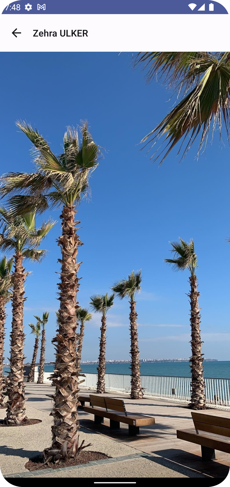

# AndroidEventApp

### We developed a fun mobile application suitable for our theme with Jetpack Compose. Instructors and participants are existed in our application, with their names, surnames, profile photos and favorite emojis are listed. Also their favorite fun photo is displayed when click any of them. We allowed our participants to fill in their own information via pull requests on Github. They forked the repo, committed some code to "AndroidEventConfig.kt" file and created pull request. And we did all this together asynchronously. We merged each of the pull requests together. 
### Thats the app!
### Enjoy!
  
  
